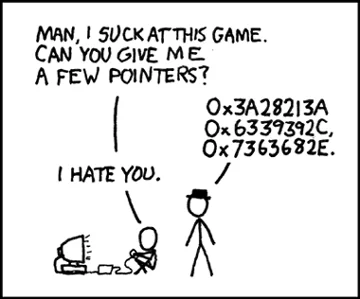

<h1 align="center">Hi 👋, I'm Cryphon</h1>

### 🧐 More About Me:
- 🔭 &nbsp; I’m currently working on **NetCore** and physics related **Engines**
- 🌱 &nbsp; I’m currently learning more quantitative and networks related concepts
- 👨🏻‍💻 &nbsp; Most of my projects are available on [Github](https://github.com/cryphon?tab=repositories)
- 📫 &nbsp; Feel free to ping me on [LinkedIn](https://www.linkedin.com/in/yvanroes/)
- 📚 &nbsp;  other than programming, I read books and enjoy playing games with my friends 😄
<!--  -->
 

### 🔨 Languages and Tools:

### Secondary Languages

### Tools and Technologies

### Web Development

 

